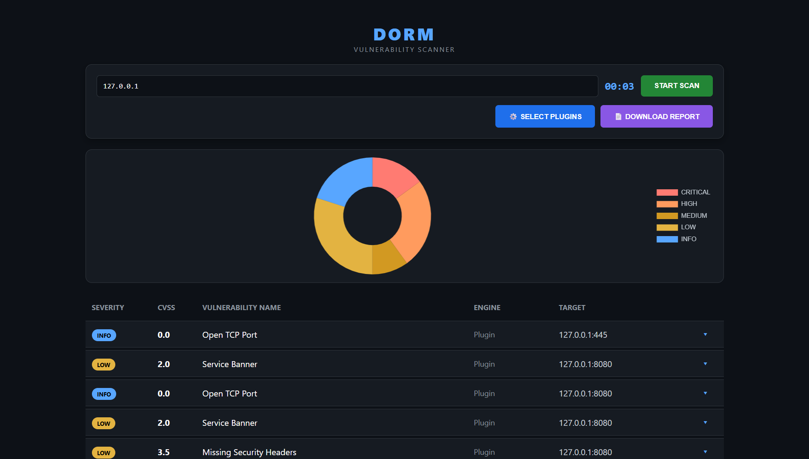
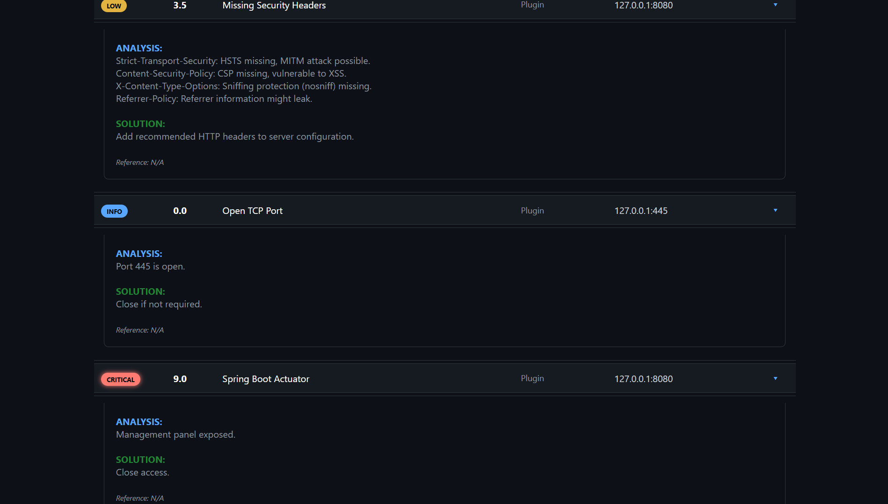

# DORM
Modern, High-Performance Vulnerability Scanner. Features: Spider Crawler, Chaos Fuzzer, and RAM-based Exploit-DB integration.

# 👁️ DORM - Next-Gen Vulnerability Scanner


**DORM** is a high-performance, concurrent, and modular vulnerability scanner written in **Go**. Designed for Red Teams and Bug Bounty hunters, it combines passive reconnaissance with active, aggressive exploitation techniques.

Unlike traditional scanners, DORM features a hybrid engine that utilizes **Headless Chrome (DOM XSS)**, **Smart Fuzzing**, and **In-Memory Exploit-DB** integration.

---

---

## ✨ Dashboard Preview

### 🖥️ Scanner Interface
<p align="center">
  
</p>

### 📊 Live Results
<p align="center">
  
</p>

<p align="center">
  <i>Real-time monitoring and advanced vulnerability detection capabilities.</i>
</p>

---

## 🚀 Key Features

### 🔥 Core Engine
- **High Concurrency:** Scans multiple targets and ports simultaneously using Go routines.
- **Smart Port Discovery:** Automatically detects web, database, and cloud services.
- **Real-Time Dashboard:** Web-based UI (SSE) to monitor scan progress live.

### 🧠 Advanced Capabilities
- **🕷️ Web Spider:** Recursively crawls the target to map the attack surface.
- **💣 Smart Fuzzer:** Mutation-based fuzzer to detect 0-Day anomalies (DoS/SQLi).
- **🕸️ DOM XSS Scanner:** Uses **Headless Chrome** to detect JavaScript-based vulnerabilities in SPA (React/Vue).
- **📚 Exploit-DB Integration:** Loads the entire Exploit Database into RAM for instant service version matching.
- **🔓 Brute Force (Mini-Hydra):** Supports dictionary attacks on SSH and FTP.

### 🛡️ 70+ Attack Modules
DORM comes with over 70 specialized plugins including:
- **Injection:** SQLi (Blind/Time), XSS (Reflected/DOM), SSTI, CRLF, Host Header.
- **Cloud & DevOps:** Docker API, Kubernetes Kubelet, AWS/Google Key Leaks, S3 Buckets.
- **Critical CVEs:** Log4Shell, Spring4Shell, Drupalgeddon2, F5 BIG-IP TMUI.
- **Misconfig:** CORS, Git/Env Exposure, Open Redirects, Subdomain Takeover.

---

## 📦 Installation

DORM requires **Go 1.21+** and **Google Chrome** (for DOM Scanner).

```bash
# 1. Clone the repository
git clone [https://github.com/yourusername/dorm.git](https://github.com/yourusername/dorm.git)
cd dorm

# 2. Initialize the module
go mod init DORM

# 3. Install dependencies
go get [github.com/chromedp/chromedp](https://github.com/chromedp/chromedp)
go get [github.com/jlaffaye/ftp](https://github.com/jlaffaye/ftp)
go get golang.org/x/crypto/ssh

# 4. Run DORM
go run main.go
