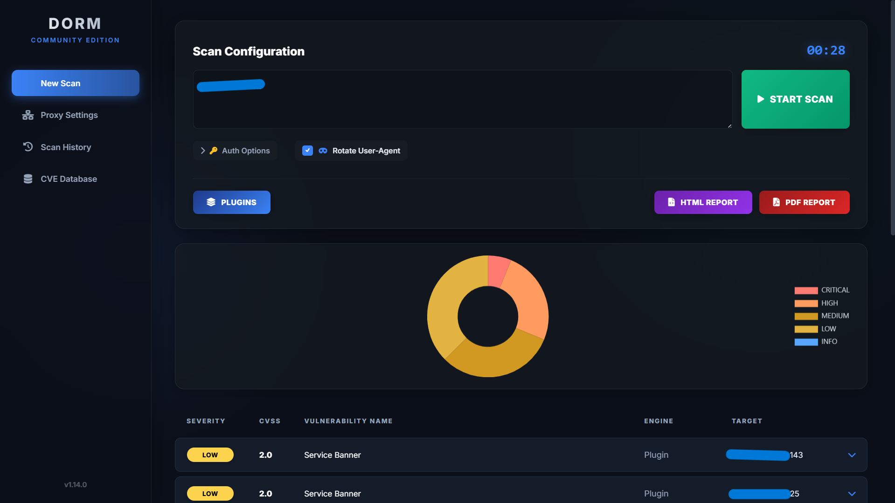
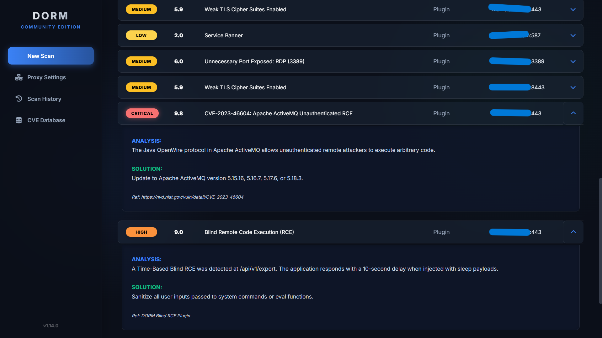

# DORM - Next-Gen Vulnerability Scanner


**DORM** is a high-performance, concurrent, and modular vulnerability scanner written in **Go**. Designed for Red Teams and Bug Bounty hunters, it combines passive reconnaissance with active, aggressive exploitation techniques.

Unlike traditional scanners, DORM features a hybrid engine that utilizes a **Native DAST Proxy**, a **Smart Spider (Active Fuzzing Engine)**, and an **Offline CVE Database** integration.

---

## ✨ Dashboard Preview

### 🖥️ Scanner Interface
<p align="center">
  
</p>

### 📊 Live Results
<p align="center">
  
</p>

<p align="center">
  <i>Premium glassmorphism dark-themed dashboard with real-time SSE monitoring and persistent history management.</i>
</p>

---

## 🚀 Key Features

### 🔥 Core Engine
- **High Concurrency:** Orchestrates non-blocking scans across multiple targets and IP ranges simultaneously using Go routines.
- **Native Proxy Analyzer:** Built-in HTTP DAST proxy (port 8081) for real-time passive traffic inspection and vulnerability detection.
- **Smart Port Risk Analysis:** Performs deep service classification and framework fingerprinting on alternative ports to identify live dev servers.
- **Dashboard & History Archival:** Real-time web-based UI (SSE) with a dedicated history viewer and HTML/PDF enterprise reporting capabilities.

### 🧠 Advanced Capabilities
- **🕷️ Smart Spider (Active Fuzzer):** Intelligently crawls, parses HTML forms, extracts API endpoints, and creates a shared intelligence pool for precision payload injections.
- **🕸️ Next-Gen DOM & Reflected XSS Engine:** Tri-phase architecture with advanced WAF-bypassing payload arsenals and line-by-line static DOM taint analysis.
- **📚 Local CVE Database & AI Correlation:** Zero-latency offline CISA KEV search engine with AI-driven Semantic Versioning for exact vulnerability matching.
- **🦎 Chameleon Mode & Evasion:** Dynamic User-Agent rotation, IP obfuscation, and smart jitter rate limiting to bypass WAFs and Firewalls.

### 🛡️ Comprehensive Attack Modules
DORM comes equipped with highly advanced, multi-phase plugins:
- **Injection Pipelines:** Omni-SQLi (6-phase), Blind RCE "Phantom Strike" (dynamic WAF bypass), XXE "XML Devil", Next-Gen SSRF (Cloud metadata & DNS rebinding), SSTI, and CRLF.
- **Authentication & Logic:** "Hydra Elite" Brute Force Engine, JWT "Key Breaker" (Algorithm Confusion), Advanced IDOR (Dual-Profile Authorization Matrix), GraphQL Introspection.
- **Cloud & DevOps:** Service exposure detection for MongoDB Wire, Tomcat "Catalina Exploiter" (In-Memory WAR Deployment), Docker API, Kubernetes, Redis.
- **AI & Emerging Threats:** Dedicated AI/LLM Prompt Injection Scanner, 403/401 Authorization Bypass, Web Cache Poisoning, and HTTP Request Smuggling.

---

## 📦 Installation

DORM requires **Go 1.21+**.

---

### 🐧 Linux / macOS

```bash
# 1. Clone the repository
git clone https://github.com/MrEx-Right/DORM.git
cd DORM

# 2. Download dependencies (single command — no manual go get needed)
go mod download

# 3. Run DORM
go run .
```

---

### 🪟 Windows

**Step 1 — Build** (one-time only):

```bash
git clone https://github.com/MrEx-Right/DORM.git
cd DORM

# Double-click build_windows.bat  — or run it from a terminal:
build_windows.bat
```

The script will:
- ✅ Verify your Go installation (1.21+ required)
- ✅ Download all dependencies via `go mod download`
- ✅ Compile `DORM.exe` in the project folder
- ✅ Terminate any existing `DORM.exe` processes to prevent port conflicts

**Step 2 — Run:**

Double-click `DORM.exe`. A console window opens showing DORM's output. **Close that window to stop DORM.**

> To rebuild (e.g. after pulling updates), run `build_windows.bat` again.
